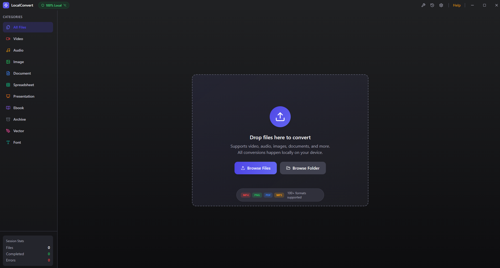
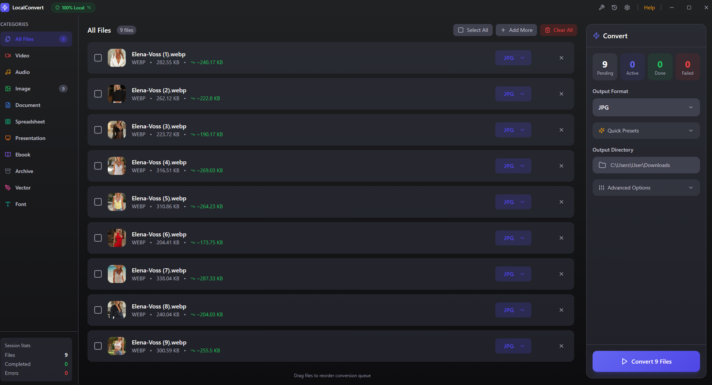
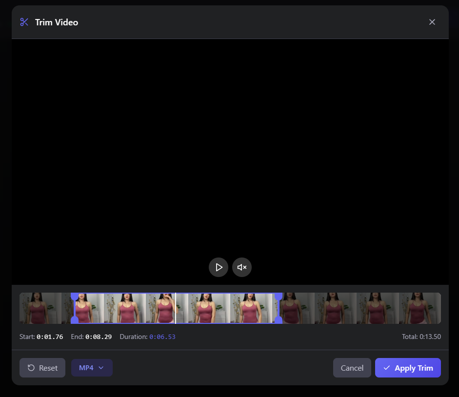
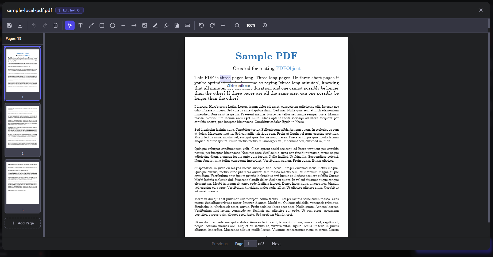

# LocalConvert - Privacy-First Local File Converter

A powerful, privacy-focused file converter that runs entirely on your device. Convert videos, audio, images, documents, and more without uploading anything to the cloud. Your files never leave your computer.


<p align="center">
  
</p>

---

## Why LocalConvert?

Unlike cloud-based converters (CloudConvert, Zamzar, Online-Convert), LocalConvert:

- **Never uploads your files** - All processing happens locally
- **Works completely offline** - No internet required after setup
- **No file size limits** - Convert files of any size
- **No subscription fees** - Free and open-source (MIT)
- **Professional quality** - Uses the same engines as industry tools
- **Cross-platform** - Runs on Windows, macOS, and Linux

---

## Downloads

### Pre-built Installers

Download the latest release for your platform from [GitHub Releases](https://github.com/freddiehdxd/localconvert-app/releases):

| Platform | Download |
|----------|----------|
| **Windows** | `.exe` installer (recommended) or `.msi` |
| **macOS (Apple Silicon)** | `.dmg` for M1/M2/M3/M4 Macs |
| **macOS (Intel)** | `.dmg` for Intel Macs |
| **Linux** | `.AppImage` (universal) or `.deb` (Debian/Ubuntu) |

### Build from Source

```bash
# Clone the repository
git clone https://github.com/freddiehdxd/localconvert-app.git
cd localconvert-app

# Install dependencies
npm install

# Run in development mode
npm run tauri dev

# Build for production
npm run tauri build
```

#### Build Prerequisites

- [Rust](https://rustup.rs/) (stable)
- [Node.js](https://nodejs.org/) (v18 or later)
- **Linux only**: `sudo apt-get install libgtk-3-dev libwebkit2gtk-4.1-dev libappindicator3-dev librsvg2-dev patchelf`

---

## Features

### 100% Privacy & Offline Conversion

Your files never leave your device. LocalConvert performs all conversions locally using industry-standard tools installed on your computer. There are no uploads, no cloud processing, and no data collection. Perfect for sensitive documents, confidential videos, and private photos.

- Zero network requests during conversion
- Works in airplane mode
- No account required
- No telemetry or tracking

### 100+ Supported File Formats

Convert between over 100 file formats across 10 categories:

#### Video Conversion
Convert between MP4, WebM, MOV, AVI, MKV, WMV, FLV, MPEG, 3GP, OGV, and animated GIF. Supports H.264, H.265/HEVC, VP9, and AV1 codecs.

#### Audio Conversion
Convert MP3, WAV, FLAC, AAC, OGG, WMA, M4A, AIFF, and OPUS. Perfect for music, podcasts, voice memos, and audiobooks.

#### Image Conversion
Convert PNG, JPG/JPEG, WebP, AVIF, GIF, BMP, TIFF, ICO, SVG, and HEIC. Includes RAW format support (CR2, NEF, ARW) for photographers.

#### Document Conversion
Convert PDF, DOCX, DOC, TXT, RTF, ODT, HTML, and Markdown. Ideal for office documents and text files.

#### Spreadsheet Conversion
Convert XLSX, XLS, CSV, ODS, and TSV files. Keep your data portable across different spreadsheet applications.

#### Presentation Conversion
Convert PPTX, PPT, ODP to PDF. Share presentations in universal formats.

#### Ebook Conversion
Convert EPUB, MOBI, AZW3, PDF, and FB2. Read your ebooks on any device.

#### Archive Extraction & Creation
Work with ZIP, 7Z, RAR, TAR, TAR.GZ, and TAR.BZ2 archives. Extract or create compressed files.

#### Vector Graphics Conversion
Convert SVG, EPS, PDF, AI, and DXF vector files. Maintain scalable quality.

#### Font Conversion
Convert TTF, OTF, WOFF, WOFF2, and EOT font files. Prepare fonts for web and desktop use.

### Batch File Conversion

Convert multiple files at once with batch processing:

- Drag and drop unlimited files
- Set output format for all files at once or individually
- Parallel processing for faster conversions
- Convert entire folders recursively

<p align="center">
  
</p>

### Video Trimming & Cutting

Built-in video trimmer with visual timeline:

- Precise frame-by-frame trimming
- Visual timeline with thumbnail preview
- Set start and end points by dragging
- Preview your cuts before converting
- Export to multiple formats (MP4, MKV, WebM, AVI, MOV, GIF)

<p align="center">
  
</p>

### PDF Editor & Tools

Comprehensive PDF editing capabilities:

- **PDF Text Editing** - Click to edit text directly in PDFs
- **PDF Merge** - Combine multiple PDFs into one
- **PDF Split** - Extract pages or split into multiple files
- **PDF Compress** - Reduce file size for email
- **PDF Rotate** - Rotate pages 90, 180, or 270 degrees
- **Form Field Editing** - Fill and edit PDF forms
- **Page Thumbnails** - Visual page navigation

<p align="center">
  
</p>

### Image Preview & Comparison

Side-by-side image comparison with:

- Before/after slider comparison
- Zoom controls for detail inspection
- File size comparison (original vs. converted)
- Real-time preview of compression effects

<p align="center">
  
</p>

### GPU Hardware Acceleration

Faster video conversions with hardware encoding:

- **NVIDIA NVENC** support (GTX 600+ series)
- **AMD AMF** support (VCE/VCN)
- **Intel Quick Sync** support
- **Apple VideoToolbox** support (macOS)
- Automatic GPU detection
- Falls back to CPU when GPU unavailable

### Auto-Updater

LocalConvert checks for updates automatically on startup and can install them seamlessly. No need to manually download new versions.

### Windows Context Menu Integration

Right-click to convert (Windows only):

- "Convert with LocalConvert" in Explorer context menu
- Quick access from any folder
- Batch convert selected files

### OCR (Optical Character Recognition)

Extract text from images and scanned PDFs:

- Powered by Tesseract OCR
- Multiple language support
- Convert scanned documents to searchable PDFs

### More Features

- **Conversion Presets** - One-click presets for Web, YouTube, Instagram, Discord, podcasts, and more
- **Device Presets** - Optimized settings for iPhone, Android, PlayStation 5, Xbox, Roku, Chromecast
- **Custom FFmpeg Parameters** - Full access to FFmpeg options for advanced users
- **Output Filename Templates** - Customize output names with `{name}`, `{date}`, `{time}`, `{quality}`
- **Keyboard Shortcuts** - `Ctrl+O` open, `Ctrl+A` select all, `Enter` convert, `Delete` remove, `Escape` close
- **Conversion History** - Track and re-run past conversions
- **Dark & Light Themes** - Beautiful UI with smooth Framer Motion animations
- **Audio Completion Notification** - Know when conversions finish in the background

---

## Supported Format Conversions

### Video Formats
| Input | Output Options |
|-------|---------------|
| MP4 | WebM, MOV, AVI, MKV, GIF, WMV, FLV, MPEG, 3GP, OGV |
| WebM | MP4, MOV, AVI, MKV, GIF, WMV, FLV, MPEG, 3GP, OGV |
| MOV | MP4, WebM, AVI, MKV, GIF, WMV, FLV, MPEG, 3GP, OGV |
| AVI | MP4, WebM, MOV, MKV, GIF, WMV, FLV, MPEG, 3GP, OGV |
| MKV | MP4, WebM, MOV, AVI, GIF, WMV, FLV, MPEG, 3GP, OGV |

### Audio Formats
| Input | Output Options |
|-------|---------------|
| MP3 | WAV, FLAC, AAC, OGG, WMA, M4A, AIFF, OPUS |
| WAV | MP3, FLAC, AAC, OGG, WMA, M4A, AIFF, OPUS |
| FLAC | MP3, WAV, AAC, OGG, WMA, M4A, AIFF, OPUS |
| AAC | MP3, WAV, FLAC, OGG, WMA, M4A, AIFF, OPUS |

### Image Formats
| Input | Output Options |
|-------|---------------|
| PNG | JPG, WebP, AVIF, GIF, BMP, TIFF, ICO, PDF |
| JPG/JPEG | PNG, WebP, AVIF, GIF, BMP, TIFF, ICO, PDF |
| WebP | PNG, JPG, AVIF, GIF, BMP, TIFF, ICO, PDF |
| HEIC | PNG, JPG, WebP, AVIF, GIF, BMP, TIFF, PDF |
| RAW/CR2/NEF/ARW | PNG, JPG, WebP, TIFF |

### Document Formats
| Input | Output Options |
|-------|---------------|
| PDF | DOCX, DOC, TXT, HTML, MD, EPUB, PNG, JPG |
| DOCX | PDF, DOC, TXT, RTF, ODT, HTML, MD |
| HTML | PDF, DOCX, TXT, RTF, ODT, MD, EPUB |
| Markdown | PDF, DOCX, TXT, RTF, ODT, HTML, EPUB |

---

## Required Tools

LocalConvert uses industry-standard open-source tools. Install the ones you need:

| Tool | Purpose | Formats | Required |
|------|---------|---------|----------|
| [FFmpeg](https://ffmpeg.org/) | Video & Audio conversion | Video, Audio | Yes |
| [ImageMagick](https://imagemagick.org/) | Image conversion | Images, RAW | Yes |
| [LibreOffice](https://www.libreoffice.org/) | Document conversion | Office docs | Optional |
| [Pandoc](https://pandoc.org/) | Document conversion | Markdown, EPUB | Optional |
| [Ghostscript](https://ghostscript.com/) | PDF operations | PDF | Optional |
| [Tesseract](https://github.com/tesseract-ocr/tesseract) | OCR text extraction | Images, PDF | Optional |
| [7-Zip](https://www.7-zip.org/) | Archive operations | Archives | Optional |

LocalConvert automatically detects installed tools and will guide you through installing any that are missing.

### Platform-Specific Installation

**macOS (Homebrew):**
```bash
brew install ffmpeg imagemagick ghostscript tesseract pandoc p7zip
brew install --cask libreoffice
```

**Linux (Debian/Ubuntu):**
```bash
sudo apt-get install ffmpeg imagemagick ghostscript tesseract-ocr pandoc p7zip-full libreoffice
```

**Windows:**
Download installers from each tool's website, or use the in-app tool setup to open download pages.

<p align="center">
  
</p>

---

## Tech Stack

- **Frontend**: React 19, TypeScript, Vite, Tailwind CSS
- **Backend**: Tauri v2 (Rust)
- **State Management**: Zustand
- **Animations**: Framer Motion
- **Icons**: Lucide React
- **PDF**: pdf-lib, pdfjs-dist, lopdf (Rust)

---

## Project Structure

```
localconvert/
├── src/                    # React frontend
│   ├── components/         # UI components
│   │   ├── PdfEditor/      # PDF editing module
│   │   ├── VideoTrimmer    # Video trimming component
│   │   └── ...             # Other components
│   ├── store/              # Zustand state management
│   ├── hooks/              # Custom React hooks
│   ├── types/              # TypeScript types
│   └── utils/              # Utility functions
├── src-tauri/              # Rust backend
│   ├── src/
│   │   ├── lib.rs          # App setup & plugin registration
│   │   ├── commands.rs     # Tauri IPC commands
│   │   ├── converter.rs    # Conversion logic
│   │   ├── tools.rs        # Cross-platform tool detection
│   │   ├── types.rs        # Rust types
│   │   └── pdf_text_editor.rs  # Pure Rust PDF editing
│   └── capabilities/       # Tauri v2 permissions
└── .github/workflows/     # CI/CD for cross-platform releases
```

---

## Development

### Commands

```bash
# Start development server
npm run tauri dev

# Build production app
npm run tauri build

# Run frontend only
npm run dev

# Build frontend only
npm run build
```

---

## Contributing

Contributions are welcome! Please submit issues and pull requests on GitHub.

---

## License

This project is licensed under the [MIT License](LICENSE).

---

## Acknowledgments

- [Tauri](https://tauri.app/) - Cross-platform app framework
- [FFmpeg](https://ffmpeg.org/) - Video/audio processing
- [ImageMagick](https://imagemagick.org/) - Image processing
- [LibreOffice](https://www.libreoffice.org/) - Document conversion
- [Pandoc](https://pandoc.org/) - Universal document converter
- [Ghostscript](https://ghostscript.com/) - PDF processing
- [Tesseract](https://github.com/tesseract-ocr/tesseract) - OCR engine
- [Lucide](https://lucide.dev/) - Beautiful icons
- [pdf-lib](https://pdf-lib.js.org/) - PDF manipulation

---

## Keywords

file converter, video converter, audio converter, image converter, document converter, PDF editor, offline converter, privacy file converter, local file converter, batch converter, video trimmer, format converter, MP4 converter, WebM converter, HEIC converter, RAW converter, FFmpeg GUI, ImageMagick GUI, cross-platform file converter, free file converter, open source converter, Windows converter, macOS converter, Linux converter
